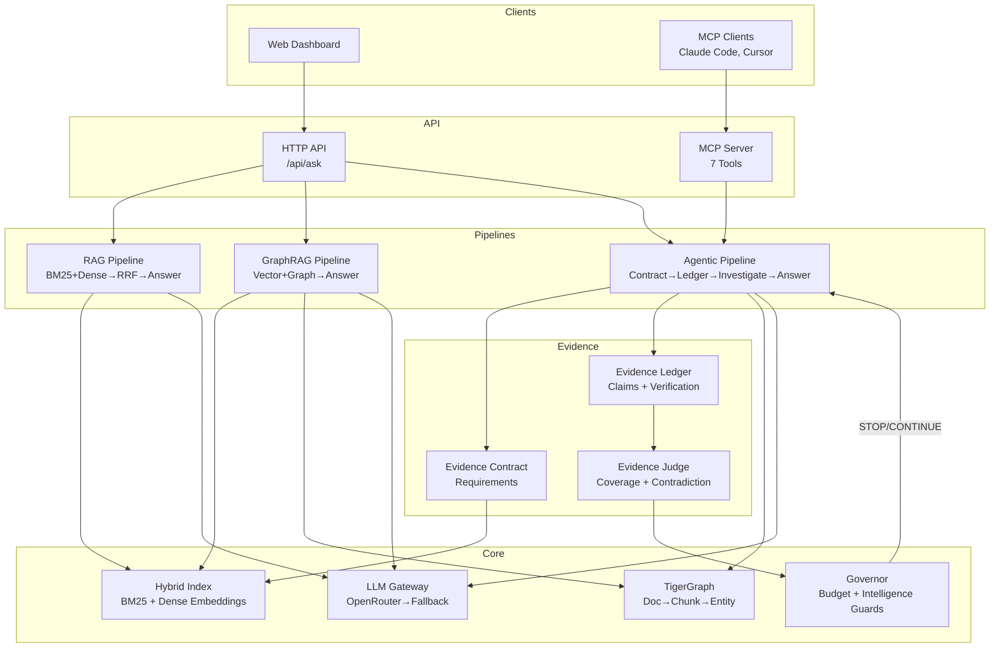
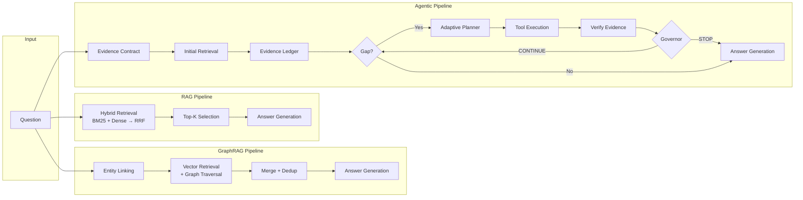
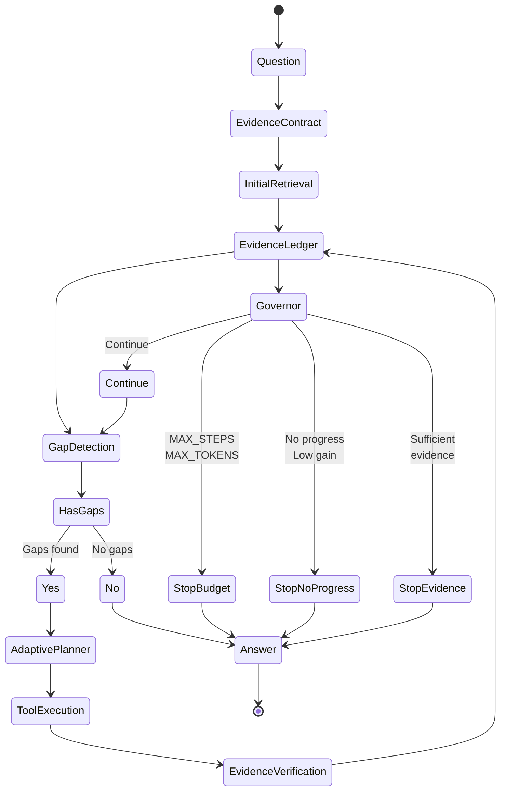
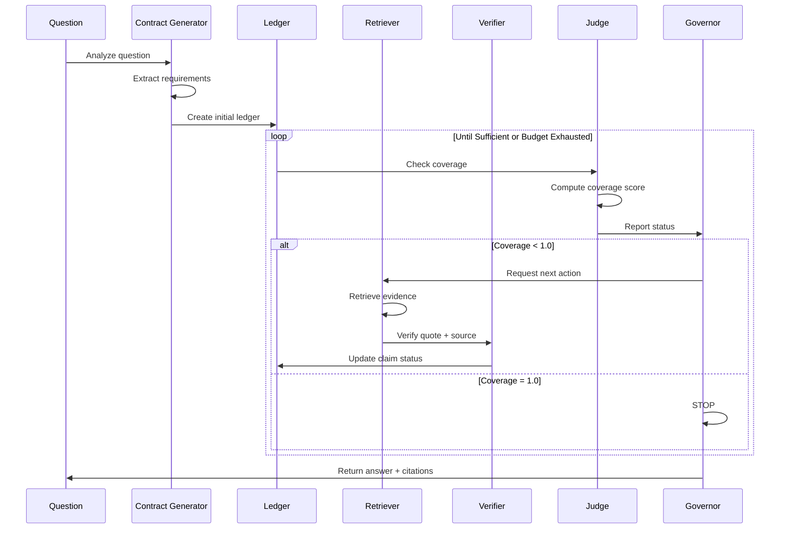
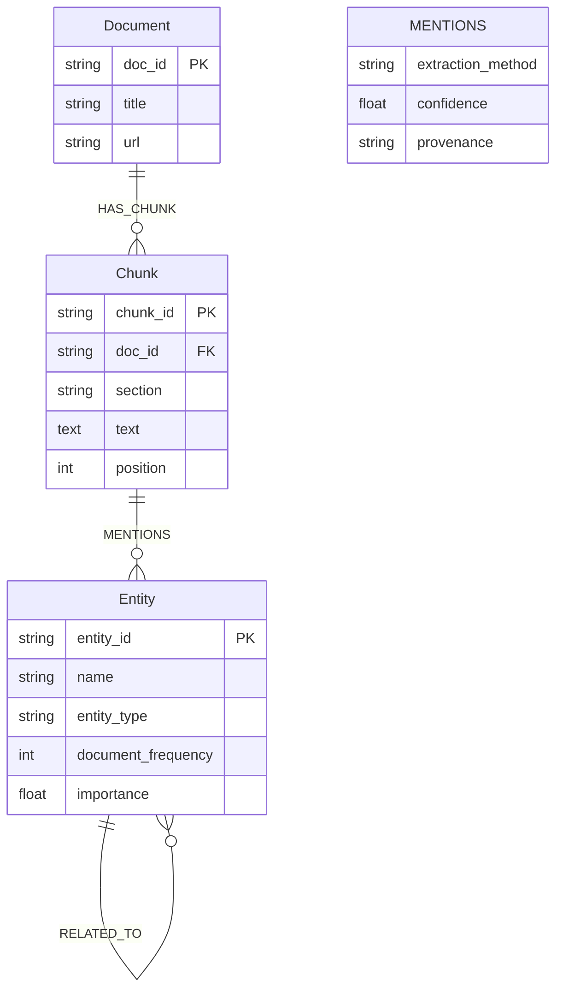
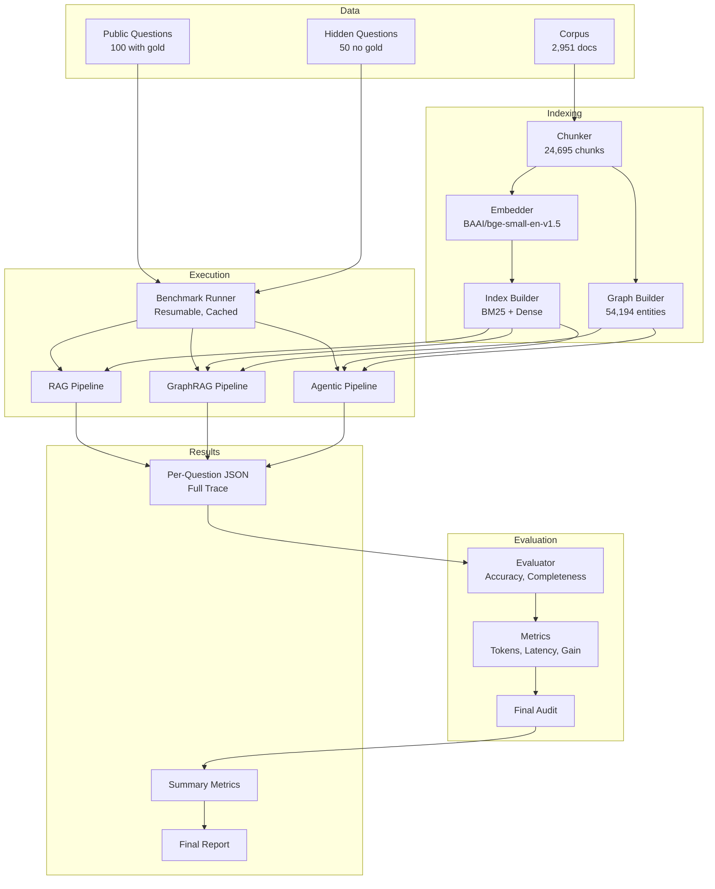
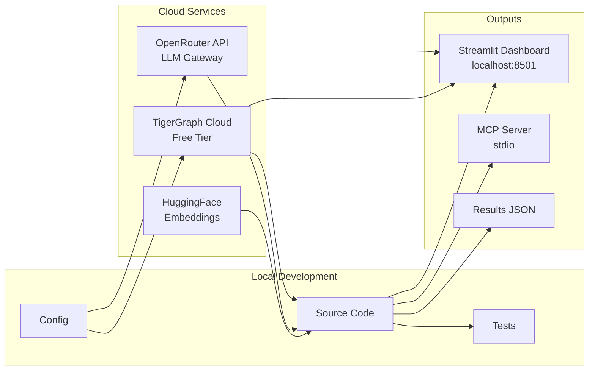
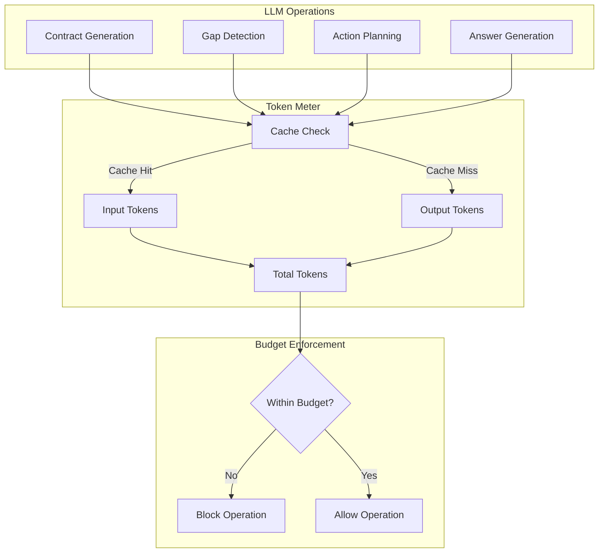
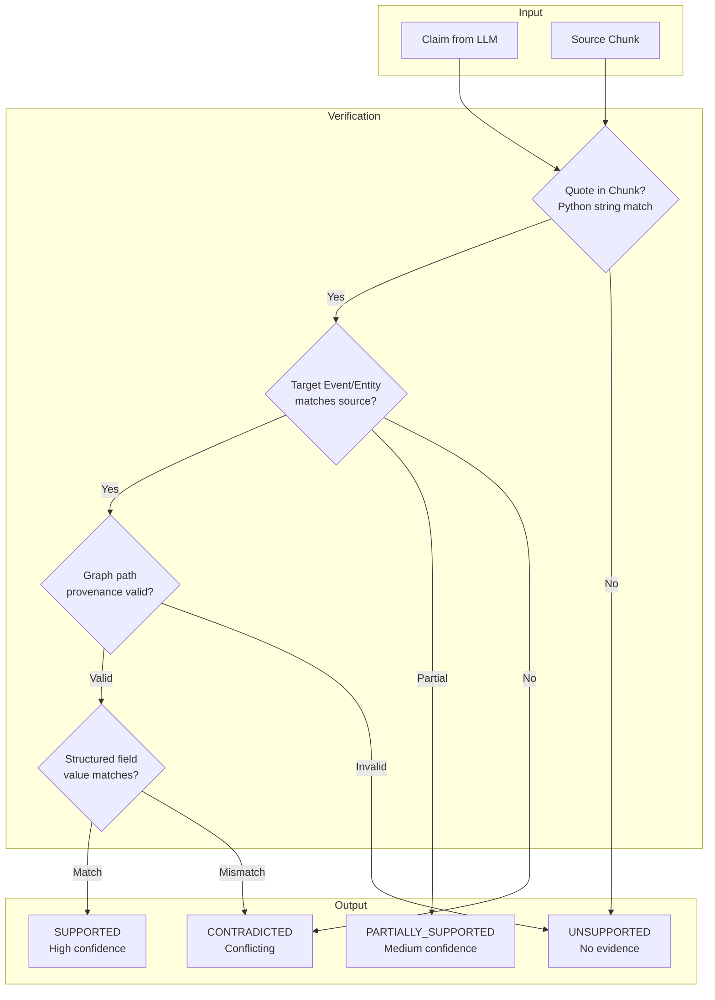
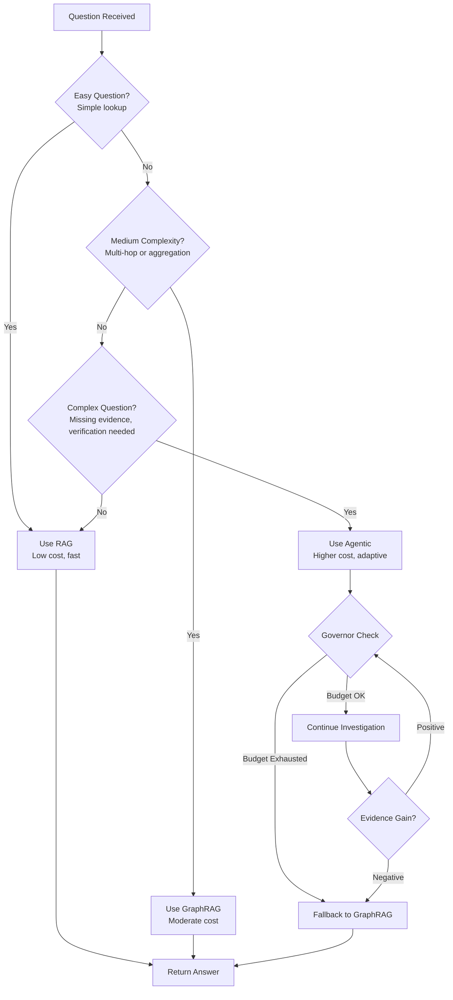

# GraphProbe-X Architecture

## System Architecture

## Three-Pipeline Comparison

## Agentic Investigation Loop

## Evidence Contract & Ledger Flow

## TigerGraph Data Model

## Benchmark Architecture

## Deployment Flow

## Token Accounting Flow

## Evidence Verification Pipeline

## Cost-Benefit Decision Tree

---

## Key Architectural Principles

1. **Same Substrate**: All pipelines share corpus, chunks, embeddings, answer model, evaluator
2. **Fair Comparison**: Only retrieval/control mechanism differs
3. **Evidence-First**: Never answer without verified evidence
4. **Cost-Aware**: Measure token cost at every step
5. **Governor Control**: LLM proposes, Python validates and enforces
6. **Target-Aware Verification**: Prevent wrong-event contamination
7. **Reproducible**: Immutable results, resumable runner, full traces
8. **Honest**: Never fake benchmarks, never bypass validation

---

For implementation details, see:
- [`app/pipelines/`](../app/pipelines/) - Pipeline implementations
- [`app/evidence/`](../app/evidence/) - Evidence Contract, Ledger, Verifier
- [`app/agents/`](../app/agents/) - Orchestrator, Tools, Governor
- [`benchmark/`](../benchmark/) - Runner, Evaluator, Metrics
